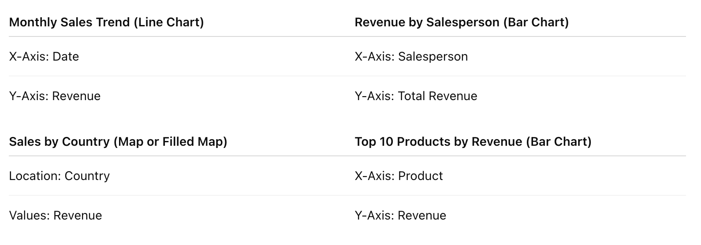
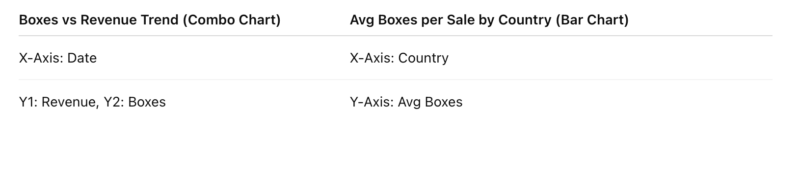

# DASHBOARDS

## DASHBOARD WIREFRAME: Visual Layout Overview

`Here’s a structured wireframe layout for your Chocolate Sales Dashboard in Power BI.`

### 🖼️ Top Row – Executive Summary (KPI Cards)

- Use “Card” visuals in a horizontal row across the top:

    - Total Revenue
    - Total Boxes Shipped
    - Avg Sale Amount
    - Top Country
    - Top Product

### 📊 Middle Section – Key Visuals

### 📈 Bottom Section – Operational Efficiency & Product Details

### 🎛️ Filters/Slicers (Sidebar or Top Panel)

- Date Range
- Country
- Salesperson
- Product
- Box Volume Range (if needed)

---

`Excellent, Luiza. Let’s take your project a step forward and outline visualizations that effectively answer those strategic questions, using a dashboard layout structure. I'll structure this to align with common BI tools like Power BI, Tableau, or Excel — keeping it modular and business-ready.`

## DASHBOARD STRUCTURE – “Chocolate Sales Performance Dashboard”

### SECTION 1: Executive Summary (KPI Indicators)

- These provide a snapshot of performance at a glance:
    - Total Revenue (USD) → `Card/Tile`
    - Total Boxes Shipped → `Card/Tile`
    - Average Sale per Transaction → `Card/Tile`
    - Top-Selling Country (by Revenue) → `Card/Tile`
    - Top Product (by Volume or Revenue) → `Card/Tile`

🧠 **Goal**: Help leadership immediately see key figures.

### SECTION 2: Sales Trends Over Time

- Visualizations:
    - 📈 Line chart: Monthly Total Revenue
    - 📊 Column chart: Monthly Number of Boxes Shipped
    - 📆 Heatmap calendar: Daily Sales Activity (optional)

🧠 **Goal**: Identify seasonal trends, peak sales periods, or drops in sales.

### SECTION 3: Performance by Salesperson

- Visualizations:
    - 🧍‍♂️ Bar chart: Total Revenue by Salesperson
    - 📦 Bubble chart: Boxes Shipped vs Revenue by Salesperson
    - 📊 Table: Salesperson | Total Revenue | Total Boxes | Avg Sale

🧠 **Goal**: Compare salesperson performance and efficiency.

### SECTION 4: Geographic Performance

- Visualizations:
    - 🗺️ Filled map: Total Sales by Country
    - 📊 Stacked bar chart: Revenue by Country and Product

🧠 **Goal**: Highlight top-performing and underperforming regions.

### SECTION 5: Product Insights

- Visualizations:
    - 🍫 Bar chart: Top 10 Products by Revenue
    - 📦 Bar chart: Top Products by Number of Boxes
    - 💰 Scatter plot: Price per Box vs Volume per Product

🧠 **Goal**: Understand which products bring volume and which drive revenue.

### SECTION 6: Operational Insights

- Visualizations:
    - 📈 Line chart: Boxes Shipped vs Revenue over Time
    - ⚖️ Gauge/Donut chart: Average Revenue per Box
    - 📊 Bar chart: Average Boxes per Sale by Country/Salesperson

🧠 **Goal**: Understand how efficiently the operation supports revenue.

### SECTION 7: Filters/Slicers Panel (for interactivity)

- Place these on the side or top to allow the user to drill down:
    - 🗓️ Date Range
    - 🌍 Country
    - 👤 Salesperson
    - 🍫 Product
    - 📦 Box Volume Range

